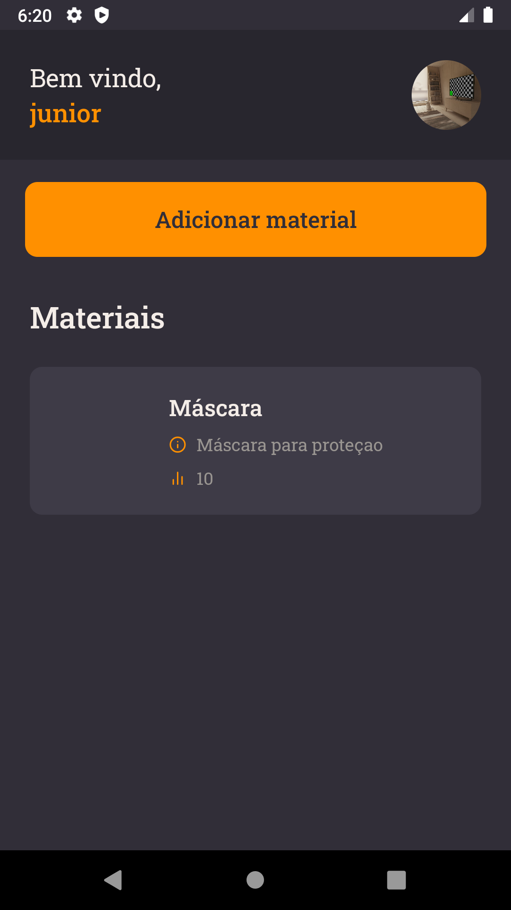

<h1 align="center">
 
Myterial
</h1>

dentists' instruments and materials management application.

  

  

## Features

- Users can create a material;
- Users can see their own materials.;
- Users can create a account;
- Users can update their avatar;
- Users can update their profile info;
- Users can loggin in;

- ⚛️ **React Native** — A lib that provides a way to create native apps for Android and iOS

## Getting started

- Clone project > enter the project folder
- Update src > env.example.js with correct values
- run `yarn`
- run `yarn android`

## License

This project is licensed under the MIT License - see the [LICENSE](https://opensource.org/licenses/MIT) page for details.

---

Created with passion by me 👨🏻‍💻
